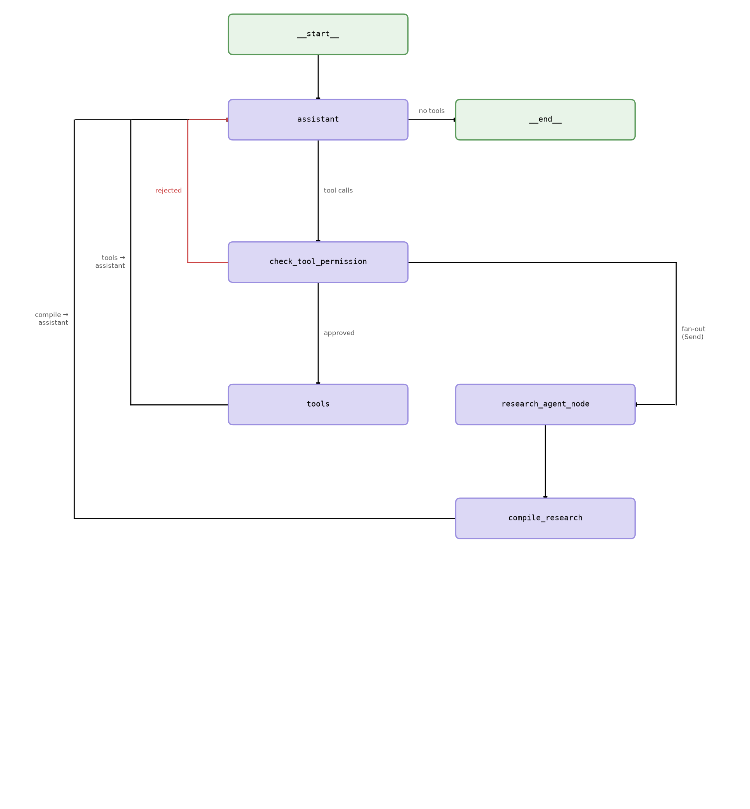

# ReAct Orchestrator

A [LangGraph](https://github.com/langchain-ai/langgraph)-based agent harness built around a **ReAct loop with human-in-the-loop tool approval** and a reusable **fan-out/fan-in orchestration pattern** for parallel sub-agent task execution.

The repository currently implements a parallel internet research workflow, where an orchestrator delegates independent research tasks to concurrent worker agents before synthesizing and aggregating the results back to the orchestrating agent. The underlying orchestration layer is workflow-agnostic and can be extended with additional worker types and virtual tools while reusing the existing routing, approval, and aggregation mechanisms.

The agent is equipped with a toolbox for file-system navigation, content and context discovery, and writing workflows, enabling it to explore local files and directories, gather supporting information, and produce artifacts as part of larger agent-driven tasks.

The architecture is provider-agnostic: the LLM backend (currently TogetherAI) and web search client (currently Tavily) can be swapped with minimal code changes.


## Architecture



The graph has two distinct execution paths:

**Main loop** — `assistant → check_tool_permission → tools → assistant`  
The `assistant` node streams the LLM response. If the model emits a tool call, execution moves to `check_tool_permission`, which can interrupt and prompt the user for approval before proceeding. Rejected calls inject a `ToolMessage` denial back into the message history and return to `assistant`. Approved standard tool calls are handled by LangGraph's `ToolNode` and the result is fed back to `assistant`.

**Research fan-out** — `check_tool_permission → research_agent_node(s) → compile_research → assistant`  
When the model calls `parallel_internet_research_agent`, `check_tool_permission` detects the virtual tool and uses LangGraph `Send` to dispatch one research sub-agent via `research_agent_node` per query in parallel. Each worker runs its own internet research and synthesizes the results with a dedicated LLM call. `compile_research` joins all branches, packages the results as a single `ToolMessage`, resets the intermediate research state, and hands control back to `assistant`.

### Nodes

| Node | Role |
|------|------|
| `assistant` | Main ReAct LLM node; streams tokens and may emit tool calls |
| `check_tool_permission` | Human-in-the-loop gate; interrupts for approval when enabled |
| `tools` | LangGraph `ToolNode`; executes all standard (non-virtual) tools |
| `research_agent_node` | Parallel worker; runs one search query and synthesizes results |
| `compile_research` | Joins fan-out branches into a single tool response |

## Tools

### Internet research

| Tool | Description |
|------|-------------|
| `internet_research` | Single web search; expects a full natural-language query |
| `parallel_internet_research_agent` | Virtual tool intercepted by the router to trigger the fan-out pattern across multiple independent queries |

### File navigation & context

| Tool | Description |
|------|-------------|
| `get_working_directory` | Return the current working directory |
| `change_directory` | Change the working directory |
| `list_directory` | List entries in a directory |
| `list_files_recursive` | Recursively list files matching a glob pattern |
| `path_exists` | Check whether a path exists |
| `is_directory` / `is_file` | Type checks for a path |
| `get_absolute_path` | Resolve a path to its absolute form |
| `make_directory` | Create a directory tree |
| `get_file_size` | Return file size in bytes |
| `find_file_in_directory` | Non-recursive filename search with optional fuzzy matching |
| `find_file_in_directory_or_subdirectories` | Recursive filename search with optional fuzzy matching |
| `search_file_contents` | Keyword/phrase search within a file with context lines |
| `get_file_contents` | Read a file's text content (truncated to ~1000 tokens) |
| `get_full_directory_information` | Metadata (size, modified time, type) for all entries in a directory |
| `write_markdown_file` | Write markdown content to a timestamped file |

## Logging

Three log targets are written at runtime (paths configured in `.env`):

- **`SEARCH_LOGS`** — JSONL of every search request and response, tagged `single` or `multiple` depending on which tool triggered the search
- **`AGENT_RESPONSE_LOGS`** — JSONL of full conversation message histories, written on clean exit
- **`GENERAL_LOGS`** — Standard Python `logging` output for node-level debug/info events

Log paths are excluded from version control via `.gitignore`.

## Setup

Requires Python ≥ 3.12 and [`uv`](https://github.com/astral-sh/uv).

```bash
git clone <repo>
cd general_agent_orchestrator
uv sync
cp .env.example .env   # then fill in your values
```

### Environment variables

Create a `.env` file in the project root:

```dotenv
# LLM provider (TogetherAI by default — swap in any LangChain chat model)
TOGETHER_API_KEY=your_together_key
LLM_MODEL=meta-llama/Llama-3.3-70B-Instruct-Turbo
LLM_MAX_TOKENS=8096

# Web search (Tavily by default — swap in any search client)
WEBSEARCH_API_KEY=your_tavily_key

# Tool approval: set to 'y' to prompt before every tool call, 'n' for automatically # approved tool calls.
# PARALLEL_TOOL_CALLS controls whether the LLM may emit multiple tool calls
# in a single response. Keep this 'n' — it is incompatible with per-call
# approval prompts and is unnecessary: the parallel_internet_research_agent
# fan-out runs concurrently via LangGraph Send regardless of this setting.
ASK_TOOL_PERMISSIONS=y
PARALLEL_TOOL_CALLS=n

# Log destinations (relative or absolute paths)
SEARCH_LOGS=logs/search
AGENT_RESPONSE_LOGS=logs/chat_traces
GENERAL_LOGS=logs/general_logs

# Python logging level: DEBUG | INFO | WARNING | ERROR | CRITICAL
LOGGING_LEVEL=WARNING
```

## Running

```bash
uv run general-agent-orchestrator
```

Type `!exit` at the prompt to end the session and flush conversation history to the response log. On first run the agent graph diagram is rendered and saved to `docs/agent_graph.png`.

## Swapping providers

**LLM** — replace the `ChatTogether` instances in `nodes.py` with any LangChain-compatible chat model (e.g. `ChatOpenAI`, `ChatAnthropic`, `ChatOllama`) and update the relevant `*_API_KEY` variable.

**Web search** — replace the `TavilyClient` calls in `agent_tools.py` and `nodes.py` with any search client (e.g. Firecrawl, Brave Search, SerpAPI). The contract is: accept a query string, return a list of results with a `content` field.

## Project structure

```
src/general_agent_orchestrator/
├── main.py          # Entry point, REPL loop, session cleanup
├── graph.py         # LangGraph graph definition and compilation
├── nodes.py         # All node and conditional-edge functions
├── agent_tools.py   # Tool definitions and registries
├── state.py         # AgentState schema and custom reducers
├── settings.py      # Pydantic settings loaded from .env
└── agent_logger.py  # Logging configuration

utils/
└── draw_correct_flow.py   # Generates docs/agent_graph.png

docs/
└── agent_graph.png
```
